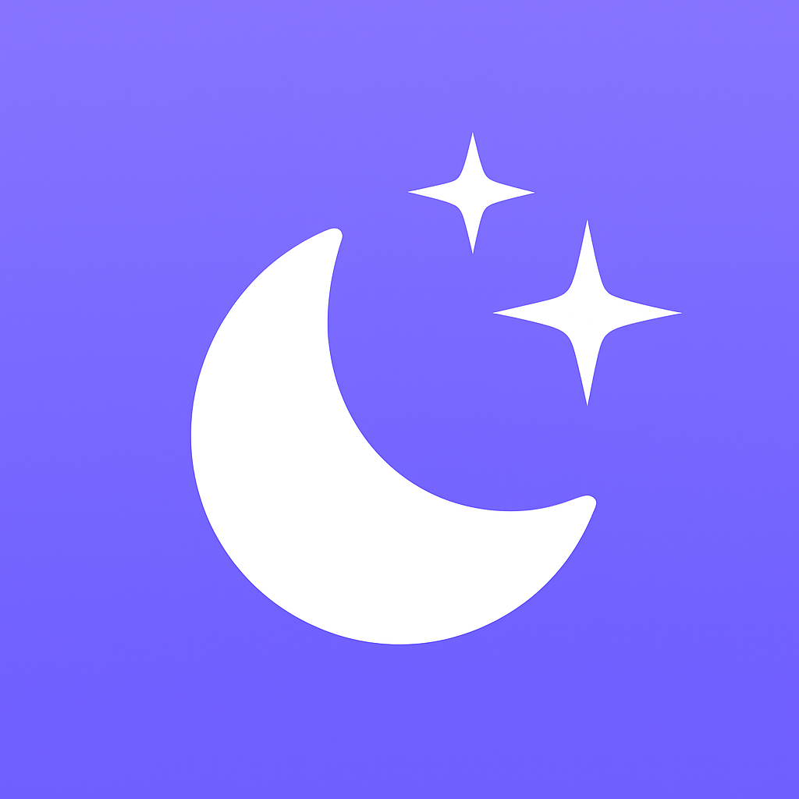

# Sleep Sounds App

<p align="center">
  
</p>

Calmly layer ambient loops like rain, ocean waves, or fireplace crackles, then set a sleep timer that fades everything out while you rest. The project is built entirely in SwiftUI with lightweight observable services for audio playback and timed automation.

## Features

- Curated catalog of looping sleep sounds with per-track accent colors and SF Symbols
- Single-tap play/pause with animated inline volume control for each card
- Sleep timer sheet with wheel pickers, quick presets, and a live countdown banner
- Audio session management that gracefully recovers after interruptions or service resets
- Haptic feedback and accessibility labels applied to key interactions

## Architecture

- `SleepSoundsAppApp.swift`: Declares the SwiftUI entry point and loads `SoundboardView`.
- `SoundboardView`: Hosts the scrollable grid of `SoundCardView` rows and presents `SleepTimerSheet`.
- `AudioManager`: `@MainActor` service that wraps `AVAudioPlayer` instances, keeps volumes in sync, and responds to `AVAudioSession` notifications.
- `SleepTimerManager`: Observable countdown timer that stops all sounds when it reaches zero.
- `SleepSound`: Model describing catalog metadata, default volumes, icons, and asset names.

Each view/model pair lives under `SleepSoundsApp/Features` or `SleepSoundsApp/Services` to keep responsibilities well scoped.

## Requirements

- Xcode 16 or newer
- iOS 17 simulator or device (the provided scheme targets iPhone 15/17, but any modern device works)
- macOS with Swift 5.9+ toolchain

## Getting Started

1. Open the workspace in Xcode:
   ```bash
   xed SleepSoundsApp.xcodeproj
   ```
2. Select the `SleepSoundsApp` scheme.
3. Choose an iOS Simulator destination (e.g., *iPhone 15*) or a connected device.
4. Build & run (`⌘R`). The catalog loads immediately and sounds begin looping as soon as you tap play.

### Command-Line Build & Test

```bash
xcodebuild -scheme SleepSoundsApp -destination 'platform=iOS Simulator,name=iPhone 15' build
xcodebuild -scheme SleepSoundsApp -destination 'platform=iOS Simulator,name=iPhone 15' test
```

Tests live under `SleepSoundsAppTests/` once they are added; mirror the source structure when creating new cases.

## Screenshots


## Assets

- App icon: `SleepSoundsApp/Assets.xcassets/AppIcon.appiconset/AppIcon.png`
- Demo captures: located in `/screenshots` and referenced above

Ensure any additional media you introduce is licensed for redistribution before committing it to the repository.
